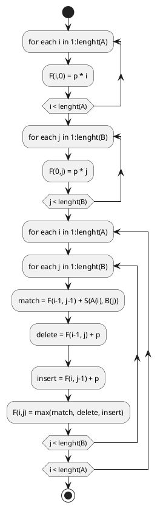

```plantuml
@startuml
start

repeat :for each i in 1:lenght(A);
   :F(i,0) = p * i;
repeat while (i < lenght(A));

repeat :for each j in 1:lenght(B);
   :F(0,j) = p * j;
repeat while (j < lenght(B));

repeat :for each i in 1:lenght(A);
   repeat :for each j in 1:lenght(B);
      :match = F(i-1, j-1) + S(A(i), B(j));
      :delete = F(i-1, j) + p;
      :insert = F(i, j-1) + p;
      :F(i,j) = max(match, delete, insert);
   repeat while (j < lenght(B));
repeat while (i < lenght(A));

stop
@enduml
```
