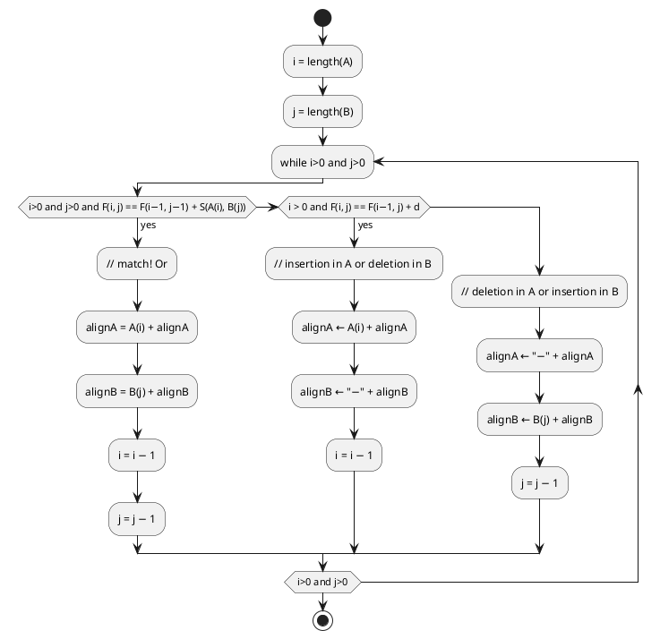

```plantuml
@startuml

start

:i = length(A);
:j = length(B);
repeat:while i>0 and j>0;
  if (i>0 and j>0 and F(i, j) == F(i−1, j−1) + S(A(i), B(j))) then (yes)
        :// match! Or;
        :alignA = A(i) + alignA;
        :alignB = B(j) + alignB;
        :i = i − 1;
        :j = j − 1;
    elseif (i > 0 and F(i, j) == F(i−1, j) + d) then (yes)
        :// insertion in A or deletion in B ;       
        :alignA ← A(i) + alignA;
        :alignB ← "−" + alignB;
        :i = i − 1;
    else
        :// deletion in A or insertion in B;
        :alignA ← "−" + alignA;
        :alignB ← B(j) + alignB;
        :j = j − 1;
   endif
repeat while ( i>0 and j>0 )

stop
@enduml
```
