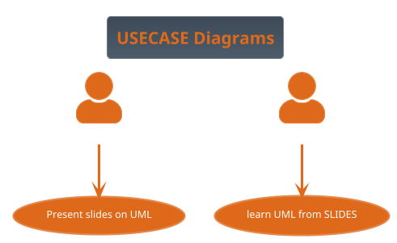

# Useful links

https://www.activestate.com/blog/top-10-python-gui-frameworks-compared/

https://leetcode.com/problemset/algorithms/

https://plantuml.com/
http://www.plantuml.com/plantuml/uml/

# Example of plantuml

